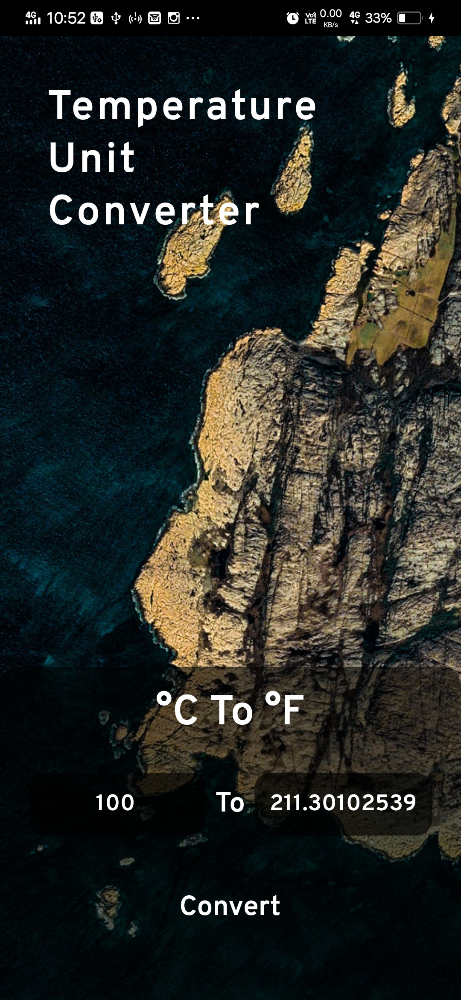

# Temperature Unit Converter

This flutter application is a Degree Celsius to Degree Fahrenheit Converter.

But, here it uses a Deep Learning Model build using Tensorflow Single Dimensional Dense Layer.

